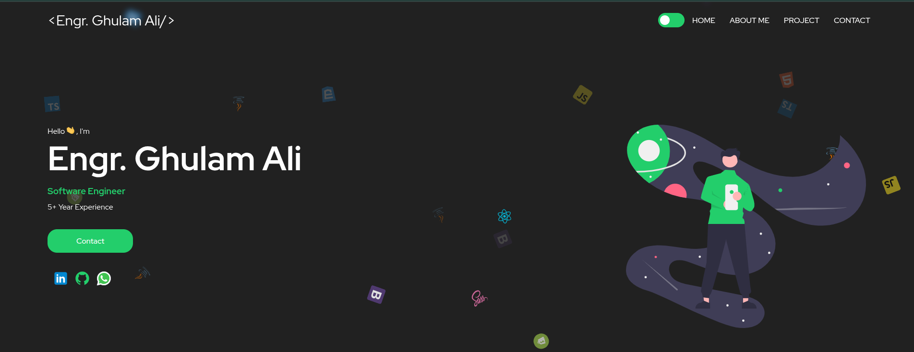
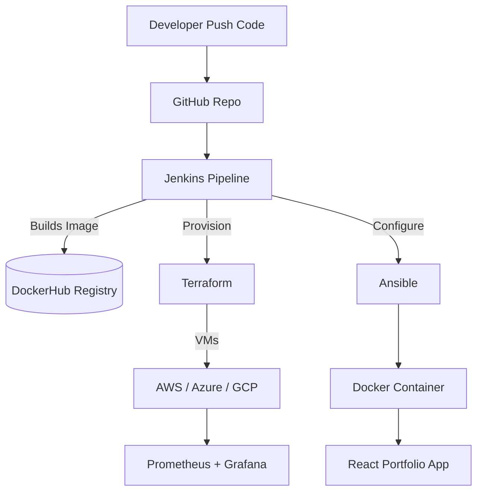

# Portfolio of Engr Ghulam Ali




# 🌐 React Multi-Cloud DevOps Project

A **Dockerized React portfolio website** deployed on **AWS, Azure, and GCP** using modern DevOps tools: **Terraform, Ansible, Jenkins, Docker, Prometheus, and Grafana**.  

This project demonstrates a **complete CI/CD pipeline** and **multi-cloud deployment strategy** for learning and portfolio purposes.

---

## 🚀 Project Overview
This project showcases how a simple **React application** (frontend only) can be deployed in a **production-style environment** using DevOps practices:  

- **Multi-Cloud Deployment** → AWS EC2, Azure VM, GCP Compute Engine  
- **Infrastructure as Code (IaC)** → Terraform  
- **Configuration Management** → Ansible  
- **CI/CD Automation** → Jenkins Pipeline  
- **Containerization** → Docker (React app served by Nginx)  
- **Monitoring** → Prometheus + Grafana dashboards  

---

## 🛠 Tech Stack
- **Frontend**: React, Nginx  
- **Containerization**: Docker  
- **CI/CD**: Jenkins  
- **Infrastructure**: Terraform (AWS, Azure, GCP)  
- **Configuration Management**: Ansible  
- **Monitoring**: Prometheus + Grafana  

---

## 📂 Repository Structure
```
react-multicloud-devops/
│── react-app/               # React frontend project
│   ├── Dockerfile
│   └── src/...
│
│── terraform/               # IaC for AWS, Azure, GCP
│   ├── aws/
│   │   ├── main.tf
│   │   └── variables.tf
│   ├── azure/
│   │   ├── main.tf
│   └── gcp/
│       ├── main.tf
│
│── ansible/
│   ├── inventory
│   └── deploy.yml
│
│── jenkins/
│   └── Jenkinsfile
│
│── monitoring/
│   ├── docker-compose.yml   # Prometheus + Grafana setup
│   └── prometheus.yml
│
│── README.md
```

---

## ⚙️ CI/CD Workflow
1. **Code Commit** → Developer pushes React app to GitHub  
2. **Jenkins Pipeline** → Triggers on Git push  
   - Builds Docker image  
   - Pushes to DockerHub  
   - Runs Terraform (provisions infra on AWS/Azure/GCP)  
   - Runs Ansible (installs Docker, runs container)  
3. **Monitoring** → Prometheus + Grafana collect metrics  

---

## 📦 Deployment Steps

### 1️⃣ Clone Repo
```bash
git clone https://github.com/your-username/react-multicloud-devops.git
cd react-multicloud-devops
```

### 2️⃣ Dockerize React App
```bash
cd react-app
docker build -t your-dockerhub/react-app:latest .
docker run -p 8080:80 your-dockerhub/react-app:latest
```

### 3️⃣ Provision Infrastructure with Terraform
Example for AWS:
```bash
cd terraform/aws
terraform init
terraform apply -auto-approve
```

### 4️⃣ Deploy with Ansible
```bash
cd ansible
ansible-playbook -i inventory deploy.yml
```

### 5️⃣ Setup Jenkins Pipeline
- Add `Jenkinsfile` from repo  
- Configure GitHub webhook for CI/CD  

### 6️⃣ Setup Monitoring (Prometheus + Grafana)
```bash
cd monitoring
docker-compose up -d
```
- Access Grafana → `http://localhost:3000`  
- Import dashboards to visualize VM & container metrics  

---

## 📊 Architecture Diagram


---

## ✅ Key Learnings
- Building a **multi-cloud deployment strategy**  
- Using **Terraform for IaC** across AWS, Azure, GCP  
- Automating deployments with **Jenkins & Ansible**  
- Containerizing apps with **Docker**  
- Setting up **monitoring with Prometheus & Grafana**  

---

## 📌 Future Improvements
- Add **Kubernetes (EKS, AKS, GKE)** deployment  
- Automate SSL (HTTPS) with Let’s Encrypt  
- Integrate **SonarQube** for code quality checks  
- Add **logging with ELK stack**  

---

## 🧑‍💻 Author
**Engr Ghulam Ali**  
🔗 [LinkedIn](https://www.linkedin.com/in/engr-ghulam-ali-548686176) | [GitHub](https://github.com/engrghulamali)

---
